# Sg-jiutishi Documentation

Written By: Karen, Law Hiu Yan

29 January 2022

# **Overall file structure**

- \> src
- \> components
- \> data
- \> images
- \> pages
- \> papers
- \> templates
- style.module.css
- gatsby-node.js

## components

- \> Content (stored the components used in main content, e.g. HomepageArticle, HomepageAuthor)
- \> Footer
- \> Navbar

## data

- \> Paper.json
- \> Poem.json
- \> Poet.json
- \> Topic.json
- \> TopicSlider.json
- \> Video.json

## images

- \> article //store the images used in HomepageArticle (HomepageArticle.js)
- \> blog //store the images used in topic pages (Topic.json)
- \> logo //store the header images (the images that are above navbar)
- \> poet //store the poet photos used in 詩人簡介 (shirenjianjie) (Poet introductions)
- \> slider //store the slider images used in topic’s carousel
- Other images (e.g. footer logos, the book cover image used in aboutUs page)

## pages

store individual pages that are not rendered from templates

- \> others (including aboutUs, shirenyinchang, yanjiulunwen)
- \> poem (special poems that have different format than normal poems, including BambooBranchVersesOfSingapore and QiuShuYuanZhuZhiCiYingYi)
- index.js (Homepage)
- 404.js
- ShuangLinSiYingLianLu (a special topic under 專題zhuanti)
- XinJiaPoJiuTiShiYingYi (a special topic under 專題zhuanti)

## papers

- \> the pdf files displayed in 研究論文 (yanjiulunwen) (research papers)

## templates

Store the templates that are ingested by Gatsby to render the individual paper, poem, poet and topic pages.

- paperTemplate.js
- poemTemplate.js
- poetTemplate.js
- topicTemplate.js

# **Topic**

## Description

- Topic means the categories that are shown on the navigation bar.
    
    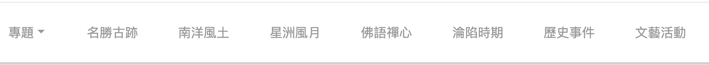
    

## File

- All topic information are stored in **Topic.json**
- Template to render each Topic: **topicTemplate.js**

## Data Structure

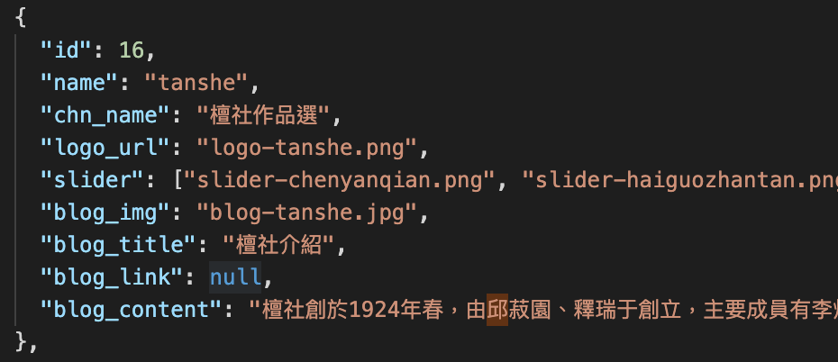

- id: Number, **must be unique and cannot be null**
- name: English name of the topic, **must be unique and cannot be null**
- chn_name: Chinese name of the topic, **must be unique and cannot be null**
- logo_url: The header image shown above navigation bar
- slider: array of images, which will be displayed in the page’s carousel
- blog_img: a static image
- blog_title: title of that page
- blog_link: this property is not utilised at all, can just simply put null
- blog_content: topic description

# **Poem**

## Description

- Poem means the poems shown on each topic page

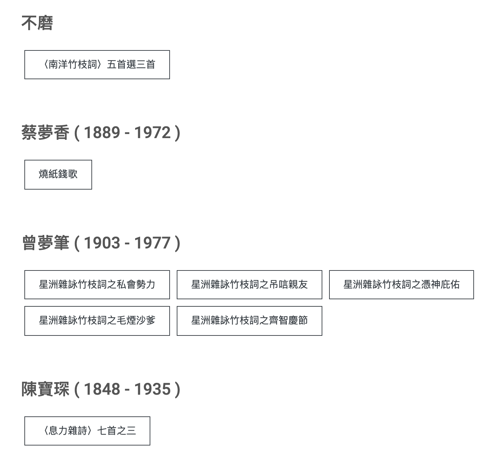

## File

- All poem information are stored in **Poem.json**
- Template to render each Poem: **poemTemplate.js**

## Data Structure

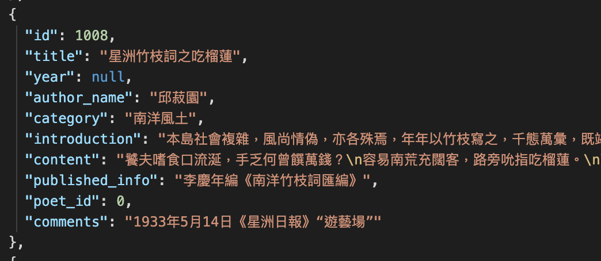

- id: Number, **must be unique and cannot be null**
- title: Chinese name of the poem, **must be unique and cannot be null**
- year: this property is not utilised at all, can just simply put null
- author_name: Chinese name of the author, **cannot be null**
- category: Chinese name of the topic that the poem belongs to, **cannot be null**
- introduction: Introduction of the poem
- content: Main content of the poem, **cannot be null**. **Include “\n” to break the lines**
- published_info: Published information of the poem
- poet_id: this property is not utilised at all, can just simply put 0
- comments: Comments for the poem

# **Poet**

## Description

- Poet means the poets shown on “詩人簡介” (Poet introductions)

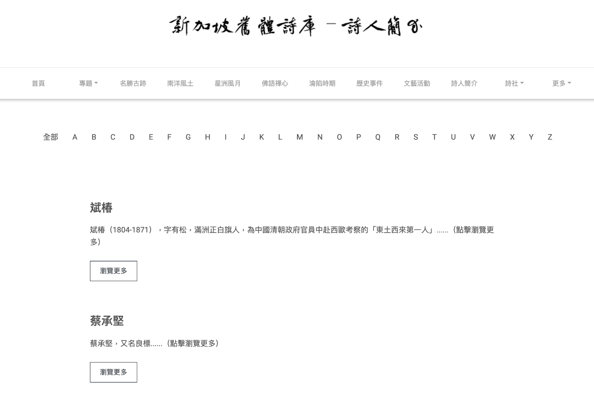

## File

- All poet information are stored in **Poet.json**
- Template to render each Poet: **poetTemplate.js**

## Data Structure

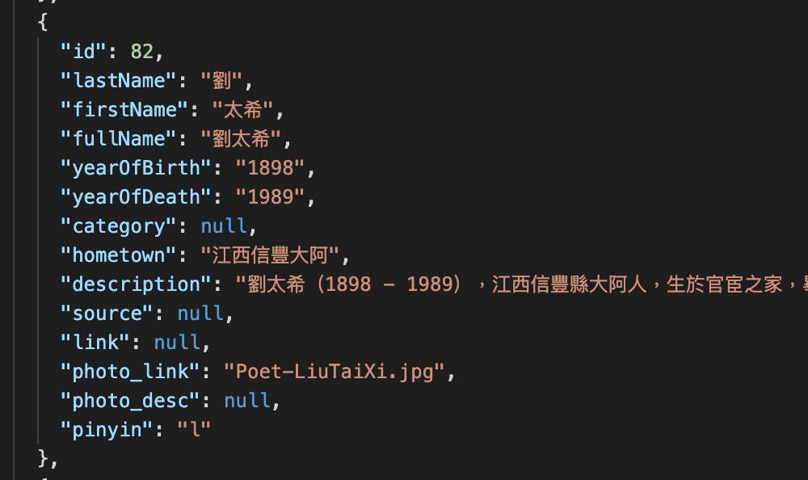

- id: Number, **must be unique and cannot be null**
- lastName: Chinese last name of the poet
- firstName: Chinese first name of the poet
- fullName: Chinese full name of the poet, must be unique and cannot be null
- yearOfBirth: Year of birth of the poet, put null if it’s unknown
- yearOfDeath: Year of death of the poet, put null if it’s unknown, put 0 if the poet is still alive
- category: this property is not utilised at all, can just simply put null
- hometown: Poet’s hometown
- description: Poet’s description, cannot be null
- source: this property is not utilised at all, can just simply put null
- link: this property is not utilised at all, can just simply put null
- photo_link: File name of the poet photo
- photo_desc: this property is not utilised at all, can just simply put null
- pinyin: First alphabetical character of lastName’s pinyin

# **Paper**

## Description

- Paper means the papers shown on “研究論文” (yanjiulunwen) (research paper)

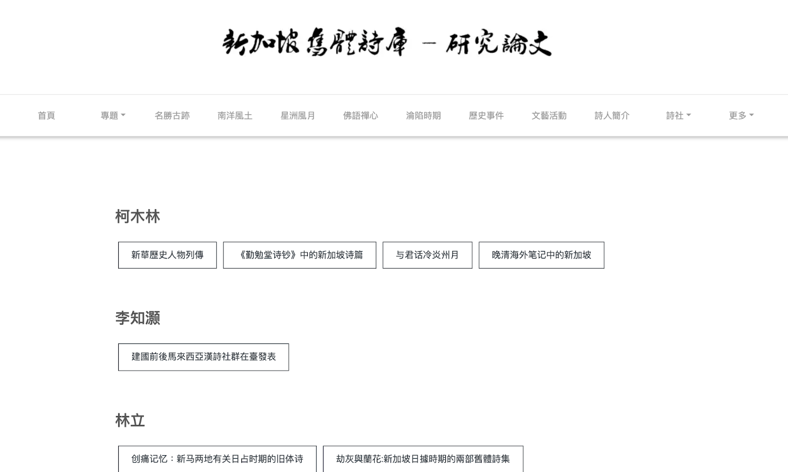

## File

- All paper information are stored in **Paper.json**
- Template to render each Paper: **paperTemplate.js**
- **Overall directory to the papers: yanjiulunwen.js**

## Data Structure

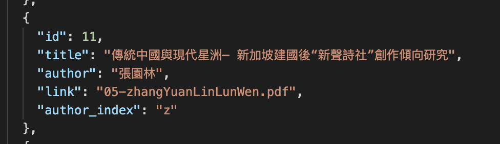

- id: Number, **must be unique and cannot be null**
- title: Chinese title of the paper, **cannot be null**
- author: Chinese name of the paper’s author, **cannot be null**
- link: PDF File name of the paper, **cannot be null**
- author_index: First alphabetical character of author’s pinyin

# **Video**

## Description

- Video means the videos shown on “詩人吟唱” (shirenyinchang) (Poet’s speeches)

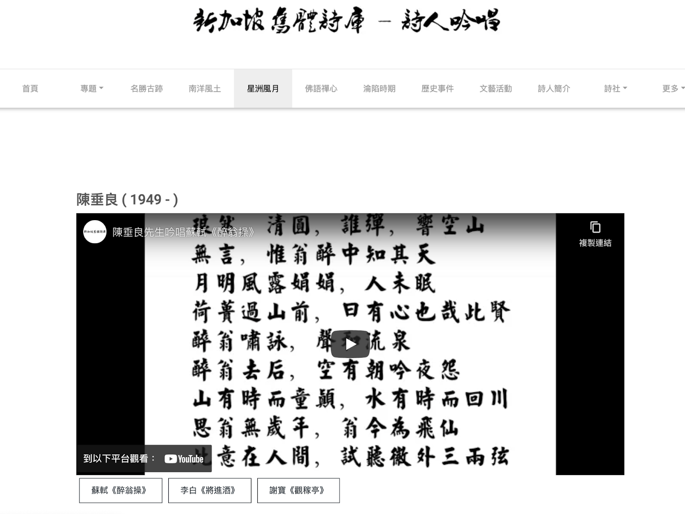

## File

- All paper information are stored in **Video.json**
- Template to render each Paper & overall directory: **shirenyinchang.js**

## Data Structure

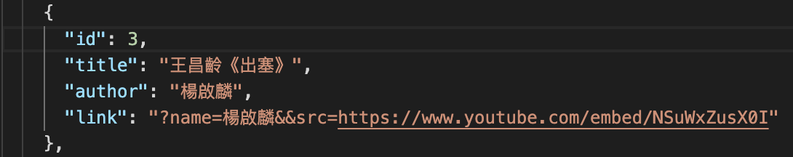

- id: Number, **must be unique and cannot be null**
- title: Chinese title of the video, **cannot be null**
- author: Chinese name of the speech’s author, **cannot be null**
- link: Cannot be null and should be in the format of: ?name=\<authorName>&&src=\<youtubeLink>

# **TopicSlider**

## Description

- TopicSlider defines the slider content shown on each topic

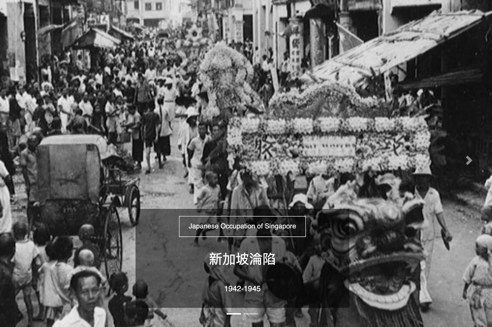

## File

- All slider information are stored in **TopicSlider.json**

## Data Structure

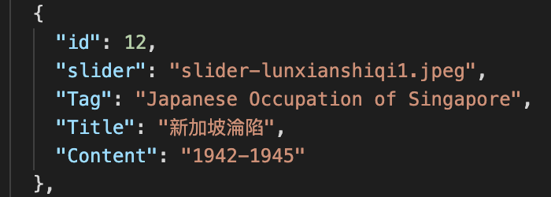

- id: Number, **must be unique and cannot be null**
- slider: File name of the slider image, **cannot be null**
- tag: Tag of the slider image
- title: Title of the slider image, **cannot be null**
- content: Content of the slider image

## Add slider image for a topic’s carousel

When you need to add a slider image to topic’s carousel, you will first need to add the filename of the slider image to the slider array of the corresponding topic in **Topic.json**

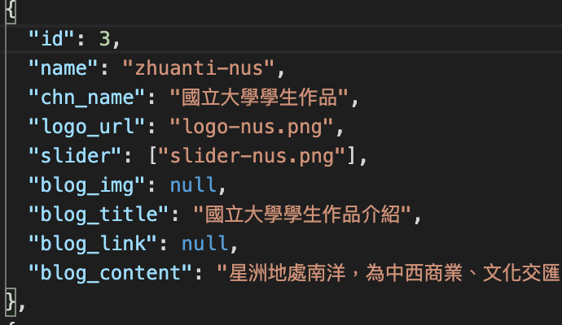

Then add the slider information in **TopicSlider.json**

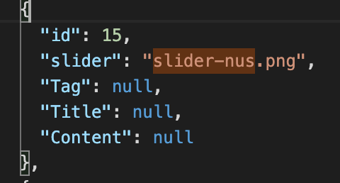

# **HomepageArticle**

## Description

- HomepageArticle defines the articles shown on homepage

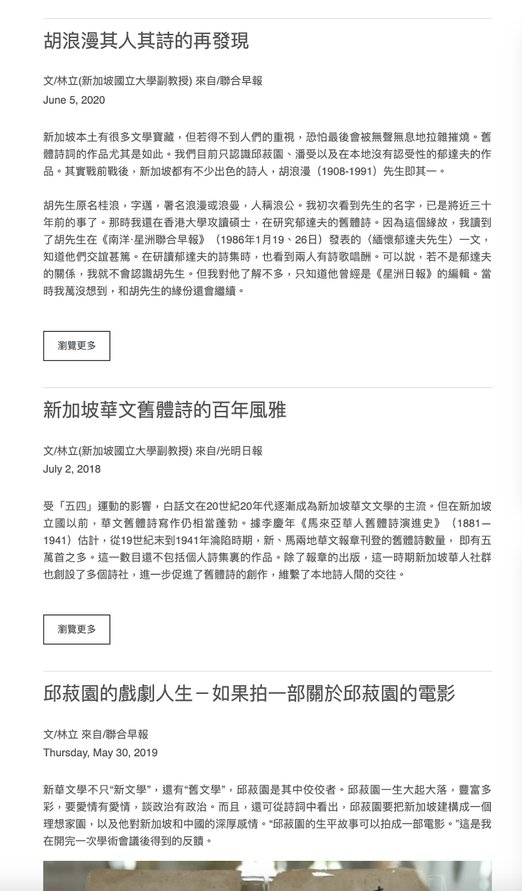

## File

- All homepage article information and template are stored in **HomepageArticle.js**

## Data Structure

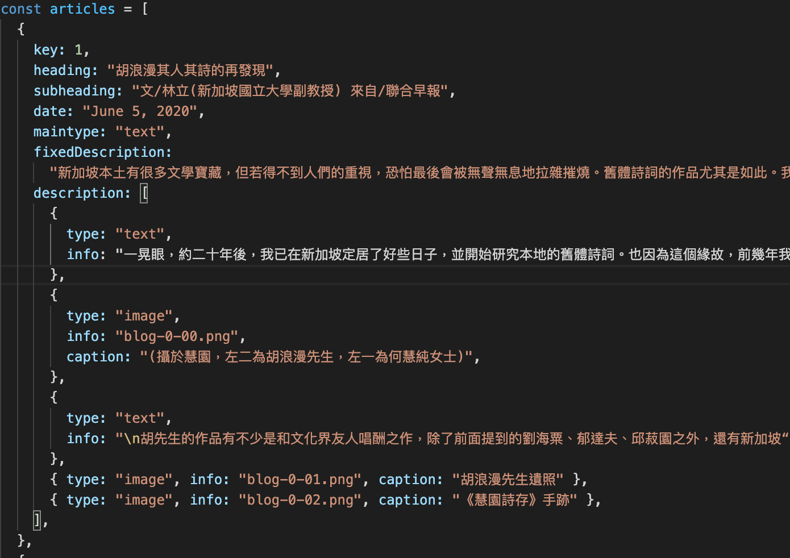

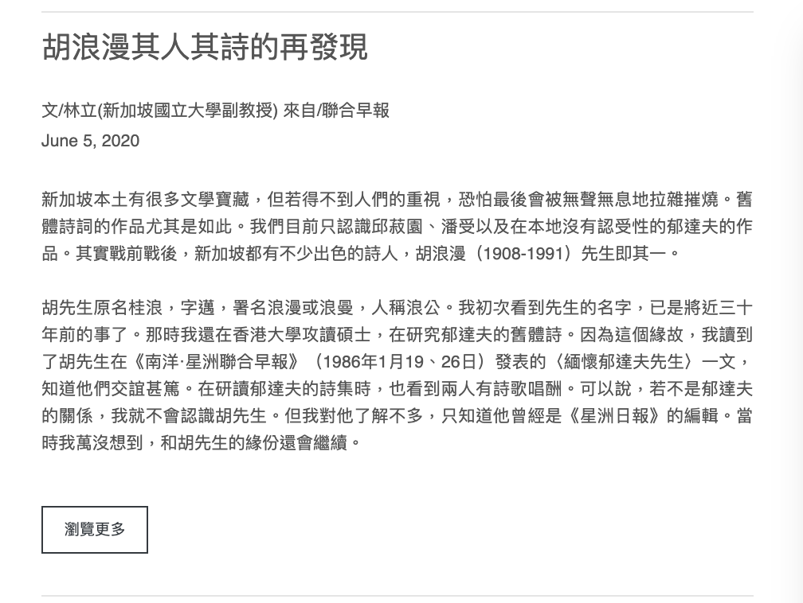

- id: Number, **must be unique and cannot be null**
- heading: Heading of the article, **cannot be null**
- subheading: Subheading of the article, put "" if empty
- date: Date of the article, put "" if empty
- maintype: Maintype of the article, if the article mainly consists of text, then put “text”, otherwise put “image” or “video”. If “text” is the maintype, “瀏覽更多” (Read more) button will appear for that article. **Cannot be null**
- fixedDescription: Only applicable to articles, of which the maintype is “text”. fixedDescription means the text that are shown before the “瀏覽更多” (Read more) button. Put "" if empty or the maintype is not “text”
- description: array of object, **cannot be null**:
    
    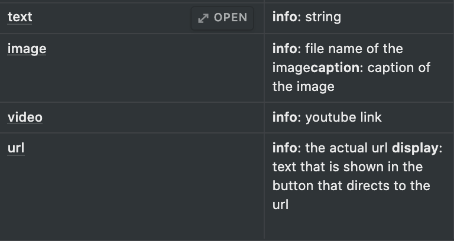
    

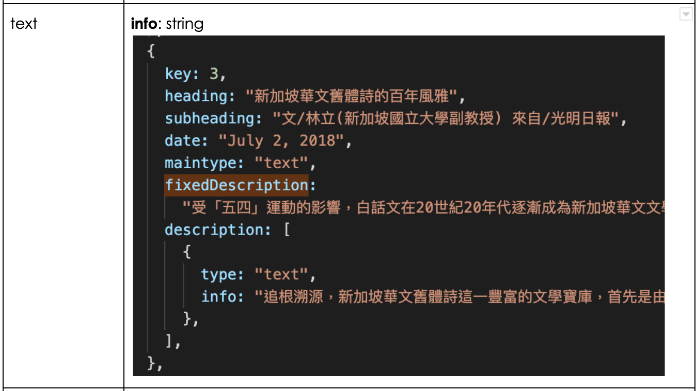

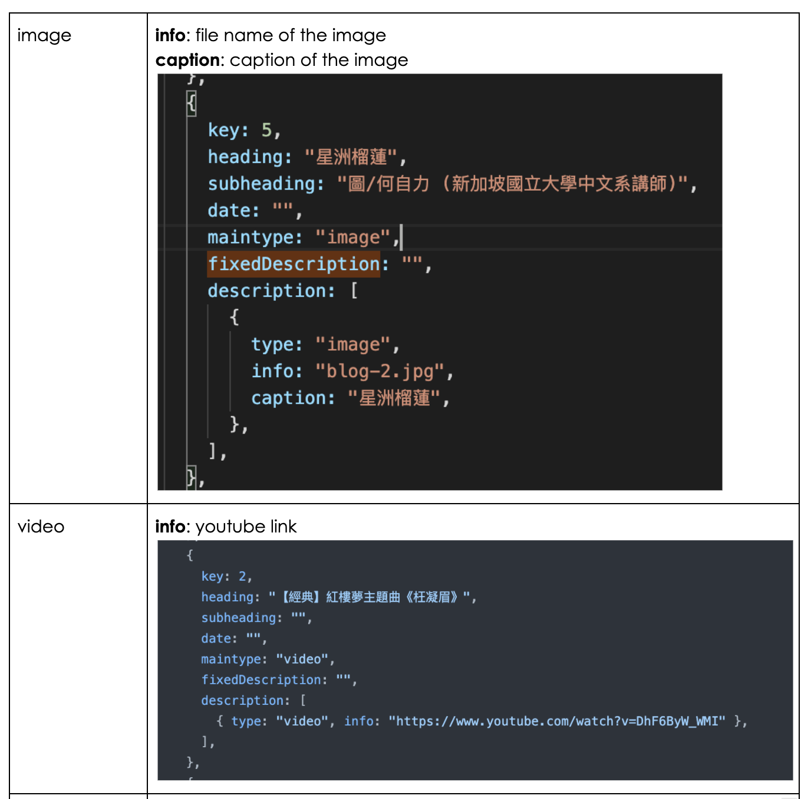

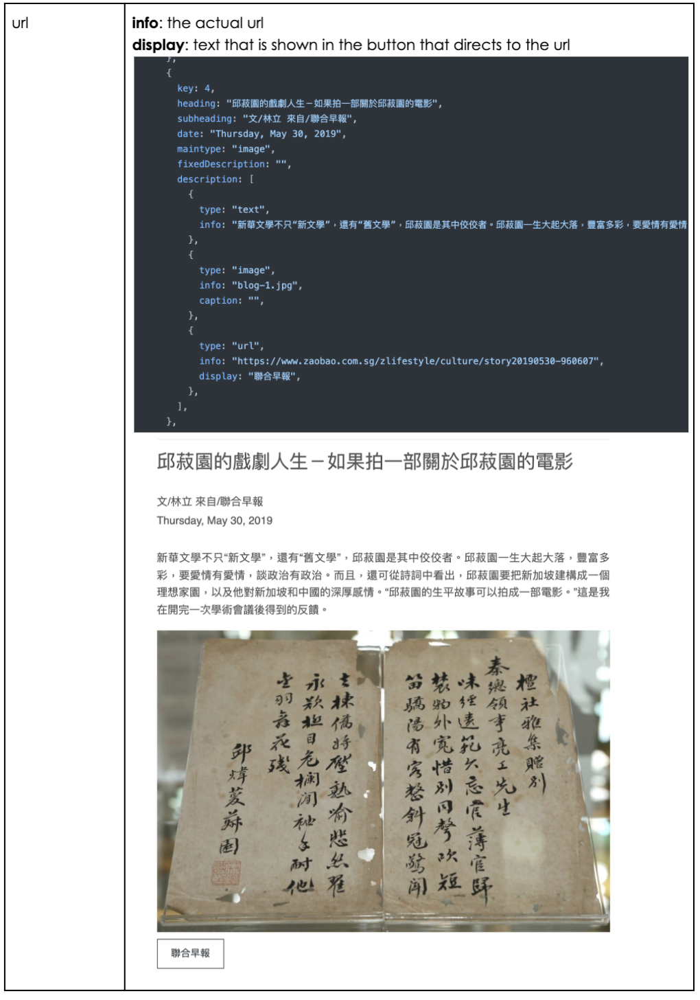

# **HomepageAuthor**

## Description

- HomepageAuthor defines the authors shown on homepage

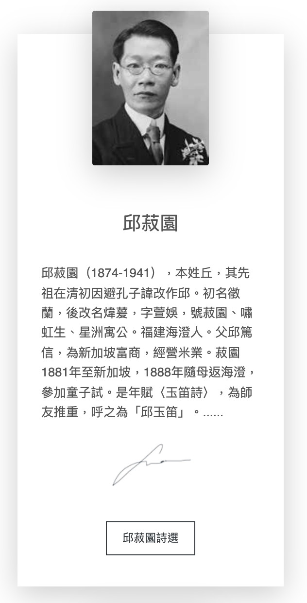

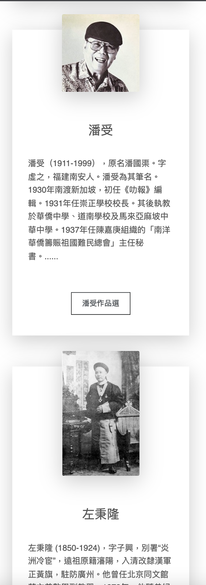

## File

- All homepage authors information and template are stored in **HomepageAuthor.js**

## Data Structure

- key: Number, **must be unique and cannot be null**
- name: Name of the author, **cannot be null**
- description: Description of the author, put "" if empty
- signature: File name of the author’s signature file, put null if empty
- collectionName: Text that is displayed on the button that directs to the author’s collection
- collectionURL: the path that directs to the collection. Note that the collection should already be a topic. If not, add the collection in Topic.json first.
- poetPicture: File name of the author’s picture file

# **style.module.css**

Defines all classes except for those in components. For the classes in components, they have separate and corresponding module.scss to use.

# **gatsby-node.js**

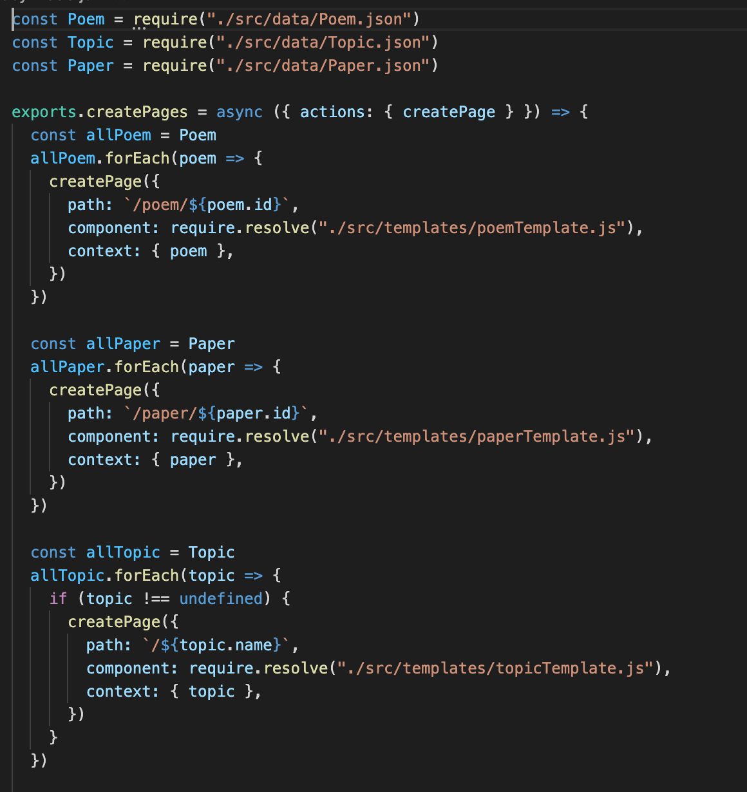

Take in a json, use createPage function to create a page for each object in the json using a specific template.

- path: path to go to the created page
- component: the template to be used to render the page
- context: the object (individual poem/poet/topic/paper)